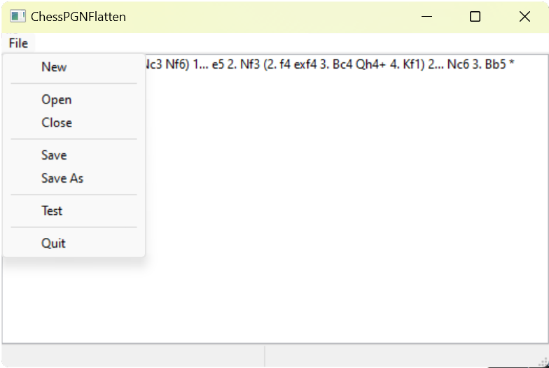

# ChessPGNFlattenGUI

My ChessPGNFlatten JavaScript tool ported to C++ wxWidgets cross-platform GUI

## Table of contents

- [Overview](#overview)
  - [Screenshot](#screenshot)
  - [Features](#features)
  - [ToDo's](#todos)
  - [Credits](#credits)

## Overview

This is a in-progress port of my project ChessPGNFlatten which takes a branching PGN and returns multiple PGN's traversing all unique variations.

### Screenshot

### Features

- Users can load and save of type PGN

### Lessons

- Learned about wxWidgets C++ GUI platform

- Underestimated scope and setup time of the project porting from JavaScript to a C++ tool with a Graphic User Interface (Initial compile time was 25 minutes)

### Todos

- Finish initial algorithm
- Input validation (Stop user from entering invalid PGN input)

### Credit

Here's a link to  [wxWidget C++ GUI library](https://www.wxwidgets.org/)
